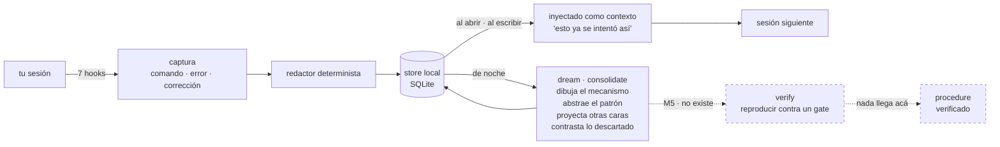

# nightshift

**Una capa de memoria procedimental sobre la memoria declarativa nativa del agente.**
Una prueba de concepto, no un producto.

*[Read this in English](README.md)*

> **Estado: M3 — captura, retrieval y dream fase 1, como plugin de Claude Code.**
> Todo lo que se describe abajo funciona. Si *sirve* está sin medir: `verify` no existe,
> así que nada llega a `procedure` y nada de lo inyectado está verificado.

## Qué hace

nightshift mira por encima del hombro mientras trabajás: cada comando, cada error y cada
corrección quedan guardados como una **trayectoria** — redactada, en tu máquina, en un
SQLite. A la noche un dream la consolida en un **patrón**: qué forma tenía el problema,
qué señal lo delató, más un diagrama del mecanismo y una conjetura de en qué otras caras
va a volver a aparecer. Cuando abrís la sesión siguiente y escribís lo que te está
pasando, te devuelve eso: no *«el timeout está en 2000»*, que es lo que sabe una memoria
declarativa, sino *«esto ya se intentó así, se probó subir el límite, alguien lo corrigió
porque tapaba el síntoma, y el camino descartado seguía siendo el correcto cuando el
límite era genuinamente bajo»*. En una frase: **para que la próxima sesión no empiece de
cero el mismo camino que la anterior ya recorrió.**



## Qué no es

Claude Code ya trae **Auto Memory** (notas declarativas por repo) y **Auto Dream**
(consolidación en background). nightshift **no** los reemplaza y no compite en «notas +
sueño»: corre encima ([ADR-001](doc/adr/ADR-001-no-competir-con-auto-dream.md)).

> Auto Memory recuerda *qué es verdad en este repo*. nightshift recuerda *cómo se
> averiguó*.

## Las cinco capacidades que reclama

| | Capacidad | ¿Construida? |
|---|---|---|
| A | Memoria procedimental: la trayectoria, no sólo la conclusión | sí |
| B | Alternativas descartadas **con la precondición** que las hacía correctas | sí ([ADR-005](doc/adr/ADR-005-contraste-entre-implementaciones.md)) |
| C | Transferencia entre repositorios | apagada por defecto |
| D | Toda inyección rastreable a su origen (`why`) | sí |
| E | Verificación: nada es procedimiento hasta que reproducirlo pasa un gate | **no — eso es M5** |

E es la que importa, y es la que no existe.

## Instalarlo y correrlo

```sh
git clone https://github.com/EvolvingAgentsLabs/nightshift
cd nightshift
./bin/nightshift init          # crea el store y resuelve deny_paths
claude --plugin-dir .          # cargarlo en esta sesión
```

Y adentro de esa sesión:

| Skill | Qué contesta |
|---|---|
| `/nightshift:status` | qué hay guardado, qué se inyectó acá |
| `/nightshift:why <id>` | de dónde salió una inyección, paso por paso |
| `/nightshift:dream` | consolidar ahora en vez de esperar la noche |
| `/nightshift:schedule` | instalar la corrida nocturna |
| `/nightshift:doctor` | si la captura está funcionando de verdad |
| `/nightshift:dev` | arrancar una sesión de desarrollo sobre el propio plugin |

## La parte honesta

El benchmark que contestaría *«¿recordar cómo se averiguó algo mejora el trabajo de un
agente que ya tiene memoria declarativa?»* tiene su runner, sus tres repos fixture y su
adaptador de agente — y **no corrió nunca**, porque el pre-registro sigue siendo un
borrador con decisiones abiertas. Todo lo que se inyecta hoy es una `candidate`:
abstraída por un modelo, reproducida por nadie.

Un ensayo no es evidencia, y una demostración no es un resultado.

- [`doc/00-spec.md`](doc/00-spec.md) — la spec
- [`doc/PLAN-v0.3.md`](doc/PLAN-v0.3.md) · [`doc/PLAN-M4.md`](doc/PLAN-M4.md) — el plan y el benchmark
- [`doc/adr/`](doc/adr/) — las decisiones y qué costó cada una
- [`experimentos/`](experimentos/) — experimentos que se corren solos, incluidos los que no favorecen al plugin
- [`LATER.md`](LATER.md) — todo lo encontrado y no arreglado

## Licencia

Apache 2.0. Ver [`LICENSE`](LICENSE).
