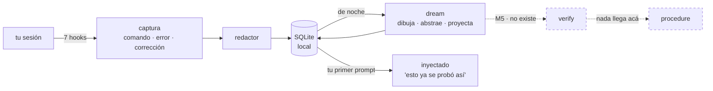

# nightshift

**Una capa de memoria procedimental sobre la memoria declarativa nativa del agente.**
Una prueba de concepto, no un producto.

*[Read me in English](README.md)*


> **Estado: M3 construido — captura, retrieval y dream fase 1, como plugin de Claude Code.**
> Todo lo de abajo corre, y el gate es `make dogfood`: el agente usando nightshift sobre
> el código de nightshift, verificado contra el store real.
>
> **El 2026-08-27 el benchmark (M4) y los gates humanos salieron del camino crítico** —
> pausados, no cerrados. Así que la pregunta que M4 iba a responder sigue sin respuesta:
> **nadie midió que nada de esto ayude.** `verify` no existe, nada llega a `procedure` y
> ninguna memoria inyectada está verificada.

## Qué hace

Mira mientras trabajás. Cada comando, cada error y cada corrección se guarda como una
**trayectoria** — redactada, en tu máquina, en SQLite. De noche un sueño las consolida en
un **patrón**: qué forma tenía el problema, qué señal lo delató, un dibujo del mecanismo, y
una conjetura sobre con qué otras caras va a volver.

En la sesión siguiente, cuando describís lo que te está pasando, te lo devuelve. No *"el
timeout es 2000"* —eso lo sabe una memoria declarativa— sino *"esto ya se probó, alguien
subió el límite, se corrigió porque tapaba el síntoma, y ese camino descartado igual tenía
razón cuando el límite era genuinamente bajo"*.

En una frase: **que la próxima sesión no recorra de cero el camino que la anterior ya
recorrió.**



## Las tres ideas

**CTE — la cadena de pensamiento *es* la cadena de ejecución.** En un agente de
programación no son dos cosas. El razonamiento que sobrevive no es un monólogo interno:
es la secuencia que tocó el filesystem — hipótesis → comando → error → corrección → señal
decisiva → fix. Esa cadena es lo que se captura, redactada, como trayectoria. La spec la
nombra *CTE capture* en la matriz de capacidades (§1.2).

**Recorrer la cadena hacia adelante, no hacia atrás.** Una cadena de pensamiento
normalmente explica algo que ya pasó. Dream la recorre al revés — trayectoria → mecanismo
→ abstracción → **conjetura** — y proyecta síntomas que nadie observó. Eso es lo que
permite que la memoria se enganche con un problema *antes* de que su síntoma haya
aparecido una vez. Lo proyectado se guarda aparte, pesa exactamente la mitad, y se anuncia
siempre como conjetura ([ADR-004](doc/adr/ADR-004-ideacion-y-proyeccion.md)). Si esa
frontera se borra, esto deja de ser memoria.

Una conjetura que llega *después* del error no proyectó nada, así que una fila que
engancha con lo que acabás de escribir **ordena antes que cualquier fila con más puntaje
que no engancha** — es una regla de orden, no un peso. Y una conjetura que nadie resuelve
no es memoria, es una nota: `/nightshift:resolve` registra que una pasó, o que no puede,
siempre con evidencia y autor. Una refutada deja de enganchar; una confirmada **no
asciende**: sigue pesando la mitad.

**Idear en vez de razonar.** No es una estrategia entre dos: desde la enmienda 0.3.7 no
hay clave de config que lo apague. El prompt de consolidación arranca negándose a razonar:
*"no razones todavía: buscá la imagen."* Hay explicaciones que sólo se entienden cuando
alguien las dibuja **bien**, y el dibujo correcto no agrega información: saca la que
sobra. La transformada discreta de Fourier no es una sumatoria con exponenciales: es
enrollar la señal alrededor de un círculo a cada velocidad y mirar dónde queda el centro
de masa. La convolución es dar vuelta una, deslizarla, y anotar el solapamiento. Al modelo
se le pide **la imagen más corta que vuelve obvio el invariante**, y recién después que
abstraiga desde el dibujo.

La apuesta es falsable —*el dibujo de un mecanismo es invariante entre síntomas de un modo
que la prosa no lo es*— y el costo está medido, no escondido: pedir la visualización
canónica casi **triplicó** los tokens de salida por grupo, 1.715 → 4.866.

## Qué no es

Claude Code ya trae **Auto Memory** (notas declarativas por repo) y **Auto Dream**
(consolidación en background). nightshift **no** los reemplaza y no compite en "notas +
sueño": corre encima ([ADR-001](doc/adr/ADR-001-no-competir-con-auto-dream.md)).

> Auto Memory recuerda *qué es verdad en este repo*. nightshift recuerda *cómo se
> averiguó*.

| | Capacidad | ¿Construida? |
|---|---|---|
| A | Memoria procedimental: la trayectoria, no sólo la conclusión | sí |
| B | Alternativas descartadas con **la precondición** que las hacía correctas | sí ([ADR-005](doc/adr/ADR-005-contraste-entre-implementaciones.md)) |
| C | Transferencia entre repositorios | apagada por defecto |
| D | Cada inyección trazable hasta su origen (`why`) | sí |
| E | Verificación: nada es procedimiento hasta que reproducirlo pase un gate | **no — es M5** |

E es la que importa, y es la que no existe.

## Correlo

```sh
git clone https://github.com/EvolvingAgentsLabs/nightshift
cd nightshift
./bin/nightshift init          # crea el store y resuelve deny_paths
claude --plugin-dir .          # cargalo en esta sesión

make dogfood                   # el gate: check + doctor + audit + status, sobre el store REAL
make experiments               # qué hipótesis del proyecto están comprobadas de verdad
```

| Skill | Qué responde |
|---|---|
| `/nightshift:status` | qué hay guardado, qué se inyectó acá |
| `/nightshift:why <id>` | de dónde salió una inyección, paso por paso |
| `/nightshift:resolve` | ¿pasó un síntoma proyectado? registralo, con evidencia |
| `/nightshift:dream` | consolidar ahora en vez de esperar a la noche |
| `/nightshift:sleep` | sellar el capítulo en curso y soñar sobre él, sin cerrar la sesión |
| `/nightshift:schedule` | instalar la corrida nocturna |
| `/nightshift:doctor` | ¿la captura está funcionando de verdad? |
| `/nightshift:dev` | arrancar una sesión de desarrollo sobre el plugin |

## La noche en que soñó sobre sí mismo

El 2026-08-27 a las 15:25 UTC el plugin consolidó el store de su propio desarrollo y, desde
el dibujo del mecanismo, **proyectó cuatro síntomas que nadie había observado**
([ADR-004](doc/adr/ADR-004-ideacion-y-proyeccion.md)). Esa misma tarde, midiendo por otro
motivo, dos resultaron ciertos:

| Lo que dream proyectó | Lo que se midió horas después |
|---|---|
| «El retrieval devuelve coincidencias por forma estructural sin relación con el contenido del trabajo.» | Dos prompts con síntomas distintos devolvían el mismo orden y los mismos scores |
| «Una revisión manual de un registro reciente muestra la estructura completa y todos los campos de texto en blanco.» | El prompt del propio dream mostraba seis pasos `(sin resumen)` de una trayectoria de 400 pasos que tenía 177 con contenido |

Tres cosas hay que decir, o es un cuento:

- **Ninguna se encontró *por* la proyección.** Estaban escritas, inyectadas y disponibles,
  y el trabajo las redescubrió midiendo. Una conjetura que nadie resuelve no es memoria:
  es una nota. Ese agujero es el que tantea
  [`experimentos/preguntar.py`](experimentos/preguntar.py).
- **El puntaje dejó de escribirse a mano.** Vivía en prosa, en dos idiomas, y se
  desincronizó: esta sección llegó a decir *«seis proyecciones: dos confirmadas, dos
  refutadas, dos abiertas»* y dos de esas cuentas no existían. Ahora lo calcula el store:
  ```sh
  nightshift resolve      # las conjeturas abiertas, y la tasa de acierto
  ```
  Al 2026-08-28: **19 proyectadas · 12 abiertas · 5 confirmadas · 2 refutadas — 71% sobre
  7 resueltas.** No copies ese número a ningún lado: corré el comando.
- **El mismo trabajo encontró tres defectos en el brazo del tratamiento.** Los tres eran
  invisibles porque todos los hooks salen 0 por diseño. Están arreglados; lo que importa es
  por qué pasaron semanas sin que nada los dijera.

## El defecto que apareció cuando alguien midió la promesa

El README de arriba promete que cuando *describís lo que te está pasando*, la memoria
vuelve. Nadie lo había medido. Medido sobre el store real: **enganchaba 1 paráfrasis de
6.** El mecanismo que este proyecto más publicita —que la memoria se enganche con un
problema antes de que su síntoma se haya visto una vez— sólo disparaba si usabas las
palabras del propio modelo.

La causa era un piso único para dos clases de texto que no se parecen: una oración que el
modelo destiló no tiene relleno, así que una palabra de contenido ya es señal; un volcado
de error es casi todo andamiaje del harness. Partido en dos, más una regla de que ninguna
coincidencia puede apoyarse sólo en palabras que dicen *que* algo se rompió y no *qué*:
**4 de 6**, con el control negativo en cero las dos veces.

Dos siguen fallando y no se arreglan por acá: `resumen`/`memoria consolidada`,
`métrica`/`contador de cobertura` no comparten una sola palabra. Eso es sinónimo, no
morfología; `difflib` y el emparejado por prefijo se midieron y no compran nada. Necesita
embeddings, que chocan con [ADR-003](doc/adr/ADR-003-modelo-de-dream.md). Espera.

Reproducilo: `python3 experimentos/05-enganche-por-parafrasis.py --alternativas`

## La parte honesta

El benchmark que respondería *"¿recordar cómo se averiguó algo mejora a un agente que ya
tiene memoria declarativa?"* tiene su runner, sus tres repos fixture y su adaptador de
agente — y **nunca corrió**. Ahora está **pausado**, y pausado no es cerrado: los 22
`TODO(Matias)` del pre-registro siguen intactos y la pregunta sigue abierta. Todo lo que
se inyecta hoy es una `candidate`: la abstrajo un modelo, no la reprodujo nadie.

Y una de ellas es **falsa**. El 2026-08-28 dream consolidó un bug de una línea y produjo
un mecanismo que no existe, con diagrama, analogía y cinco precondiciones coherentes. No
lo alucinó: levantó el razonamiento ya escrito en los comentarios del propio código y lo
presentó como su diagnóstico. Para eso existe ahora `LECTURA-DEL-REPO`, y es la razón por
la que nada llega a `procedure`.

Un ensayo no es evidencia, una demostración no es un resultado, y una proyección que se
cumplió dos veces tampoco.

- [`doc/00-spec.md`](doc/00-spec.md) — la spec
- [`doc/PLAN-TRES-IDEAS.md`](doc/PLAN-TRES-IDEAS.md) — qué le falta a cada una de las tres ideas
- [`doc/PLAN-v0.3.md`](doc/PLAN-v0.3.md) · [`doc/PLAN-M4.md`](doc/PLAN-M4.md) — el alcance, y el benchmark (pausado)
- [`experimentos/hipotesis/`](experimentos/hipotesis/) — una hipótesis por archivo: 15 de 21 comprobadas, y las otras 6 dicen por qué no
- [`doc/adr/`](doc/adr/) — las decisiones y lo que costó cada una
- [`experimentos/`](experimentos/) — experimentos que se corren solos, incluidos los que no favorecen al plugin
- [`LATER.md`](LATER.md) — todo lo encontrado y no arreglado

## Licencia

Apache 2.0. Ver [`LICENSE`](LICENSE).
