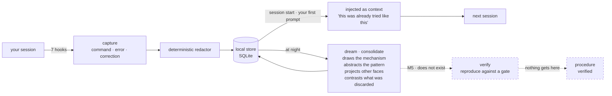

# nightshift

**A procedural memory layer over the agent's native declarative memory.**
A proof of concept, not a product.

*[Léeme en español](README.es.md)*

> **Status: M3 built — capture, retrieval and dream phase 1, as a Claude Code plugin.**
> Everything described below runs, and the code is no longer what blocks the benchmark:
> the **evidence** is. M1's gate is five real sessions and M3's is three unattended
> nights, and neither has been collected yet. Whether any of this *helps* is unmeasured:
> `verify` does not exist, so nothing reaches `procedure` and nothing injected is
> verified.

## What it does

nightshift looks over your shoulder while you work: every command, every error and every
correction is stored as a **trajectory** — redacted, on your machine, in a SQLite file.
At night a dream consolidates it into a **pattern**: what shape the problem had, which
signal gave it away, plus a diagram of the mechanism and a conjecture about which other
faces it will come back wearing. When you open the next session and describe what is
happening to you, it hands that back: not *"the timeout is 2000"* — which is what a
declarative memory knows — but *"this was already tried, someone raised the limit, it got
corrected because it papered over the symptom, and that discarded path was still the
right one when the limit was genuinely too low"*. In one sentence: **so the next session
does not walk from scratch the same road the last one already walked.**



## What it is not

Claude Code already ships **Auto Memory** (per-repo declarative notes) and **Auto Dream**
(background consolidation). nightshift does **not** replace them and does not compete on
"notes + sleep": it runs on top of them ([ADR-001](doc/adr/ADR-001-no-competir-con-auto-dream.md)).

> Auto Memory remembers *what is true in this repo*. nightshift remembers *how it was
> found out*.

## The five capabilities it claims

| | Capability | Built? |
|---|---|---|
| A | Procedural memory: the trajectory, not just the conclusion | yes |
| B | Discarded alternatives kept **with the precondition** that made them right | yes ([ADR-005](doc/adr/ADR-005-contraste-entre-implementaciones.md)) |
| C | Transfer across repositories | off by default |
| D | Every injection traceable to its source (`why`) | yes |
| E | Verification: nothing becomes a procedure until reproducing it passes a gate | **no — this is M5** |

E is the one that matters, and it is the one that does not exist.

## Install and run it

```sh
git clone https://github.com/EvolvingAgentsLabs/nightshift
cd nightshift
./bin/nightshift init          # creates the store and resolves deny_paths
claude --plugin-dir .          # load it in this session
```

Then, inside that session:

| Skill | What it answers |
|---|---|
| `/nightshift:status` | what is stored, what got injected here |
| `/nightshift:why <id>` | where an injection came from, step by step |
| `/nightshift:dream` | consolidate now instead of waiting for the night |
| `/nightshift:schedule` | install the nightly run |
| `/nightshift:doctor` | is capture actually working |
| `/nightshift:dev` | start a development session on the plugin itself |

## The night it dreamed about itself

On 2026-08-27 the plugin consolidated its own development store and, from the drawing of
the mechanism, **projected four symptoms nobody had observed** ([ADR-004](doc/adr/ADR-004-ideacion-y-proyeccion.md)).
That same afternoon, measuring for an unrelated reason, two of them turned out to be real:

| What dream projected at 15:27 | What was measured hours later |
|---|---|
| «Retrieval returns matches by structural shape, unrelated to the content of the work.» | Two prompts describing different symptoms returned the same ranking and the same scores: retrieval of raw trajectories never looked at the prompt |
| «A manual review of a recent record shows the full structure and every text field blank.» | Dream's own prompt showed six `(no summary)` steps out of a 400-step trajectory that had 177 steps with content |

Three things have to be said about that, or it is a fairy tale:

- **Neither was found *because* of the projection.** Both were written, injected and
  available, and the work rediscovered them by measuring. A conjecture nobody resolves is
  not memory — it is a note. That gap is what
  [`experimentos/preguntar.py`](experimentos/preguntar.py) probes: it shows each
  projection with options so a person can resolve it, without writing to the store and
  **without promoting anything** — a human saying yes is not a reproduction against a
  gate ([ADR-002](doc/adr/ADR-002-verify-gate.md)).
- **Two other projections were checked and did not hold.** Six projections, two
  confirmed, two refuted, two open, one store. That is an anecdote with a numerator, not
  a result.
- **The same session found three defects in the treatment arm itself** — retrieval
  ignoring the prompt, dream reading empty steps, the rehearsal blaming dream for its own
  broken `HOME`. All three were invisible because every hook exits 0 by design. They are
  fixed; the reason they went unnoticed for weeks is the point.

## The honest part

The benchmark that would answer *"does remembering how something was figured out improve
an agent that already has declarative memory?"* has its runner, its three fixture repos
and its agent adapter — and **has never run**, because the pre-registration is still a
draft with open decisions. Everything injected today is a `candidate`: abstracted by a
model, reproduced by nobody.

A rehearsal is not evidence, and a demonstration is not a result. Neither is a
projection that came true twice.

- [`doc/00-spec.md`](doc/00-spec.md) — the spec
- [`doc/PLAN-v0.3.md`](doc/PLAN-v0.3.md) · [`doc/PLAN-M4.md`](doc/PLAN-M4.md) — the plan and the benchmark
- [`doc/adr/`](doc/adr/) — the decisions and what each one cost
- [`experimentos/`](experimentos/) — runnable experiments, including the ones whose results do not favour the plugin
- [`experimentos/preguntar.py`](experimentos/preguntar.py) — human-in-the-loop over what dream only conjectured: read-only on the store, promotes nothing
- [`LATER.md`](LATER.md) — everything found and not fixed

## License

Apache 2.0. See [`LICENSE`](LICENSE).
