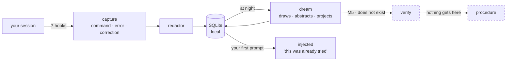

# nightshift

**A procedural memory layer over the agent's native declarative memory.**
A proof of concept, not a product.

*[Léeme en español](README.es.md)*


> **Status: M3 built — capture, retrieval and dream phase 1, as a Claude Code plugin.**
> Everything below runs, and the gate is `make dogfood`: the agent using nightshift on
> nightshift's own code, checked against the real store.
>
> **On 2026-08-27 the benchmark (M4) and the human gates were taken off the critical
> path** — paused, not closed. So the question M4 was going to answer is still
> unanswered: **nobody has measured that any of this helps.** `verify` does not exist,
> nothing reaches `procedure`, and nothing injected is verified.

## What it does

It watches while you work. Every command, every error, every correction is stored as a
**trajectory** — redacted, on your machine, in SQLite. At night a dream consolidates them
into a **pattern**: what shape the problem had, which signal gave it away, a diagram of
the mechanism, and a conjecture about which other faces it will come back wearing.

Next session, when you describe what is happening to you, it hands that back. Not *"the
timeout is 2000"* — a declarative memory knows that — but *"this was already tried,
someone raised the limit, it got corrected because it papered over the symptom, and that
discarded path was still right when the limit was genuinely too low."*

In one sentence: **so the next session does not walk from scratch the road the last one
already walked.**



## The three ideas

**CTE — the chain of thought *is* the chain of execution.** For a coding agent these are
not two things. The reasoning that survives is not an internal monologue, it is the
sequence that touched the filesystem: hypothesis → command → error → correction →
decisive signal → fix. That chain is what gets captured, redacted, as a trajectory. The
spec calls it *CTE capture* in the capability matrix (§1.2).

**Run the chain forward, not backward.** A chain of thought normally explains something
that already happened. Dream walks it the other way — trajectory → mechanism →
abstraction → **conjecture** — and projects symptoms nobody has observed. That is what
lets memory latch onto a problem *before* its symptom has appeared once. Projections are
stored separately, weighted at exactly half, and always announced as conjecture
([ADR-004](doc/adr/ADR-004-ideacion-y-proyeccion.md)). If that boundary blurs, this stops
being memory.

A conjecture reaching the agent *after* the error would have projected nothing, so a row
that latches onto what you just typed is **ordered ahead of any row with a higher score
that latches onto nothing** — a rule about order, not a weight. And a conjecture nobody
resolves is not memory, it is a note: `/nightshift:resolve` records that one happened, or
that it cannot, always with evidence and an author. A refuted one stops latching; a
confirmed one **does not get promoted** — it still weighs half.

**Imagine instead of think.** Not a strategy among two — since amendment 0.3.7 there is
no config key that turns it off. The consolidation prompt opens by refusing to reason:
*"don't reason yet — find the image."* Some explanations only land when someone draws
them **well**, and the right drawing does not add information, it removes what is
redundant. The DFT is not a sum of exponentials: it is winding a signal around a circle
at each speed and watching where the center of mass lands. Convolution is flipping one,
sliding it, and recording the overlap. The model is asked for **the shortest image that
makes the invariant obvious**, and only then to abstract from the drawing.

The bet is falsifiable — *a drawing of a mechanism is invariant across symptoms in a way
prose is not* — and the cost is measured, not hidden: asking for the canonical
visualization nearly **tripled** output tokens per group, 1,715 → 4,866.

## What it is not

Claude Code ships **Auto Memory** (per-repo declarative notes) and **Auto Dream**
(background consolidation). nightshift does **not** replace them and does not compete on
"notes + sleep": it runs on top ([ADR-001](doc/adr/ADR-001-no-competir-con-auto-dream.md)).

> Auto Memory remembers *what is true in this repo*. nightshift remembers *how it was
> found out*.

| | Capability | Built? |
|---|---|---|
| A | Procedural memory: the trajectory, not just the conclusion | yes |
| B | Discarded alternatives kept **with the precondition** that made them right | yes ([ADR-005](doc/adr/ADR-005-contraste-entre-implementaciones.md)) |
| C | Transfer across repositories | off by default |
| D | Every injection traceable to its source (`why`) | yes |
| E | Verification: nothing becomes a procedure until reproducing it passes a gate | **no — this is M5** |

E is the one that matters, and it is the one that does not exist.

## Run it

```sh
git clone https://github.com/EvolvingAgentsLabs/nightshift
cd nightshift
./bin/nightshift init          # creates the store, resolves deny_paths
claude --plugin-dir .          # load it in this session

make dogfood                   # the gate: check + doctor + audit + status, on the REAL store
make experiments               # which of the project's hypotheses are actually verified
```

| Skill | What it answers |
|---|---|
| `/nightshift:status` | what is stored, what got injected here |
| `/nightshift:why <id>` | where an injection came from, step by step |
| `/nightshift:resolve` | did a projected symptom happen? record it, with evidence |
| `/nightshift:dream` | consolidate now instead of waiting for the night |
| `/nightshift:sleep` | seal the current chapter and dream on it, mid-session |
| `/nightshift:schedule` | install the nightly run |
| `/nightshift:doctor` | is capture actually working |
| `/nightshift:dev` | start a development session on the plugin itself |

## The night it dreamed about itself

On 2026-08-27 at 15:25 UTC the plugin consolidated its own development store and, from the
drawing of the mechanism, **projected four symptoms nobody had observed**
([ADR-004](doc/adr/ADR-004-ideacion-y-proyeccion.md)). That same afternoon, measuring for
an unrelated reason, two turned out to be real:

| What dream projected | What was measured hours later |
|---|---|
| «Retrieval returns matches by structural shape, unrelated to the content of the work.» | Two prompts describing different symptoms returned the same ranking and the same scores |
| «A manual review of a recent record shows the full structure and every text field blank.» | Dream's own prompt showed six `(no summary)` steps out of a 400-step trajectory that had 177 with content |

Three things have to be said, or it is a fairy tale:

- **Neither was found *because* of the projection.** Both were written, injected and
  available, and the work rediscovered them by measuring. A conjecture nobody resolves is
  not memory — it is a note. That gap is what
  [`experimentos/preguntar.py`](experimentos/preguntar.py) probes.
- **The scoreboard is no longer written by hand.** It used to live in prose, in two
  languages, and it drifted — this section once said *"six projections, two confirmed, two
  refuted, two open"* and two of those counts did not exist. Now the store computes it:
  ```sh
  nightshift resolve      # open conjectures, and the hit rate
  ```
  On 2026-08-28: **23 projected · 15 open · 5 confirmed · 3 refuted — 62% over 8
  resolved.** Do not copy that number anywhere; run the command.
- **The same work found three defects in the treatment arm itself.** All three were
  invisible because every hook exits 0 by design. Fixed; why they went unnoticed for weeks
  is the point.

## The second night, and the one thing that can be said about it

On 2026-08-28 the plugin consolidated its own development twice, and the two results were
not the same kind of thing. That difference is the most interesting observation this
project has produced, and it is also the easiest one to overclaim, so here it is at its
real size.

**The first candidate described a mechanism that does not exist.** It abstracted a
one-line bug — an `or` that dropped a marker — into *"a derived property travels as an
ephemeral flag that does not cross the sealing step"*, with a diagram, an analogy and five
coherent preconditions. It had not hallucinated: it lifted the reasoning already written
in the code's **own comments** — *"no flag in between"*, *"the command is redacted, and
that does not affect it"* — and presented it as its diagnosis of a bug those comments were
not about.

**The second one did not.** Its pattern — *"the work closes green because the automated
gate passes, but every real failure happens outside it, in improvised commands: a name
coined in intent travels as pure text and only breaks at the first stage that resolves it
against something real"* — is a fair description of what actually happened. Four of its
five signals are verifiable observations from that session: the gate green while ad-hoc
one-liners failed, a traceback from hand-built arguments, a shell parse error, a
trajectory left open with `unknown`. The fifth, a push rejected by refspec, **could not be
confirmed** — it may be a conflation. Four out of five, and the fifth named.

It also produced the store's first **contrast** ([ADR-005](doc/adr/ADR-005-contraste-entre-implementaciones.md)):
the discarded approach kept with the precondition under which it was still right. Its
`cost` field names a real price of that day's change that nobody had written down —
*"correcting the definition retroactively rewrites what old trajectories meant, and no
record is kept that they meant something else."*

### What changed in between, and what that is worth

Between the two runs, two things shipped that target exactly the first failure: steps that
**read the repository** (`grep`, `cat`, `git log`) now reach the model labelled
`LECTURA-DEL-REPO` — context, never evidence — and the hypothesis must cite a step that
**observes** something, or stay `null`. Measured on the real store: **50% and 67%** of the
steps in those trajectories were the repository reading itself, arriving with the same
rank as a failure.

**And that is one run against one run, on different corpora, in different sessions.** It
is not evidence that the fix worked. It is the first observation consistent with it, and
the difference between those two sentences is the whole discipline of this repository.

Run it forward yourself:

```sh
nightshift why 07695a69     # the chain, the drawing, the contrast, what git says
nightshift resolve          # the conjectures it left open
```

## The defect that only showed up when someone measured the promise

The README above promises that when you *describe what is happening to you*, the memory
comes back. Nobody had measured that. Measured on the real store: **1 paraphrase out of 6
hooked.** The mechanism this project advertises most — memory latching onto a problem
before its symptom has been seen once — only fired when you used the model's own words.

The cause was one threshold for two kinds of text that are nothing alike: a sentence the
model distilled has no filler, so one content word is already signal; a raw error dump is
mostly harness scaffolding. Split in two, plus a rule that a match can never rest only on
words that say *that* something broke rather than *what*: **4 out of 6**, with the negative
control at zero both times.

Two still fail, and they are not fixable this way — `resumen`/`memoria consolidada`,
`métrica`/`contador de cobertura` share no word at all. That is synonymy, not morphology;
`difflib` and prefix matching were measured and buy nothing. It needs embeddings, which
collide with [ADR-003](doc/adr/ADR-003-modelo-de-dream.md). It waits.

Reproduce it: `python3 experimentos/05-enganche-por-parafrasis.py --alternativas`

## The honest part

The benchmark that would answer *"does remembering how something was figured out improve
an agent that already has declarative memory?"* has its runner, its three fixture repos and
its agent adapter — and **has never run**. It is now **paused**, and paused is not closed:
the 25 `TODO(Matias)` in the pre-registration are untouched and the question stays open.
Everything injected today is a `candidate`: abstracted by a model, reproduced by nobody.

And one of them is **false**. On 2026-08-28 dream consolidated a one-line bug and produced
a mechanism that does not exist — with a diagram, an analogy and five coherent
preconditions. It did not hallucinate it: it lifted the reasoning already written in the
code's own comments and presented it as its diagnosis. That is what `LECTURA-DEL-REPO`
now exists for, and it is why nothing reaches `procedure`.

A rehearsal is not evidence, a demonstration is not a result, and neither is a projection
that came true twice.

- [`doc/00-spec.md`](doc/00-spec.md) — the spec
- [`doc/PLAN-TRES-IDEAS.md`](doc/PLAN-TRES-IDEAS.md) — what each of the three ideas is still missing
- [`doc/PLAN-v0.3.md`](doc/PLAN-v0.3.md) · [`doc/PLAN-M4.md`](doc/PLAN-M4.md) — the scope, and the benchmark (paused)
- [`experimentos/hipotesis/`](experimentos/hipotesis/) — one hypothesis per file: **23 hypotheses**. As of 2026-08-28: **21 verified**, 1 against, 1 waiting on material — `make experiments` walks them. The one that fails is the project's own bet
- [`doc/adr/`](doc/adr/) — the decisions and what each one cost
- [`experimentos/`](experimentos/) — runnable experiments, including the ones whose results do not favour the plugin
- [`LATER.md`](LATER.md) — everything found and not fixed

## License

Apache 2.0. See [`LICENSE`](LICENSE).
