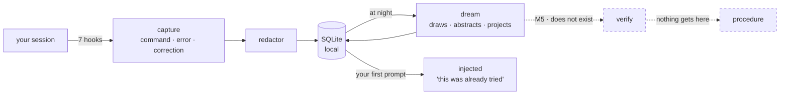

# nightshift

**A procedural memory layer over the agent's native declarative memory.**
A proof of concept, not a product.

*[Léeme en español](README.es.md)*


> **Status: M3 built — capture, retrieval and dream phase 1, as a Claude Code plugin.**
> Everything below runs. The code is no longer what blocks the benchmark: the **evidence**
> is. M1's gate is five real sessions, M3's is three unattended nights, and neither has
> been collected. Whether any of this *helps* is unmeasured: `verify` does not exist, so
> nothing reaches `procedure` and nothing injected is verified.

## What it does

It watches while you work. Every command, every error, every correction is stored as a
**trajectory** — redacted, on your machine, in SQLite. At night a dream consolidates them
into a **pattern**: what shape the problem had, which signal gave it away, a diagram of
the mechanism, and a conjecture about which other faces it will come back wearing.

Next session, when you describe what is happening to you, it hands that back. Not *"the
timeout is 2000"* — a declarative memory knows that — but *"this was already tried,
someone raised the limit, it got corrected because it papered over the symptom, and that
discarded path was still right when the limit was genuinely too low."*

In one sentence: **so the next session does not walk from scratch the road the last one
already walked.**



## What it is not

Claude Code ships **Auto Memory** (per-repo declarative notes) and **Auto Dream**
(background consolidation). nightshift does **not** replace them and does not compete on
"notes + sleep": it runs on top ([ADR-001](doc/adr/ADR-001-no-competir-con-auto-dream.md)).

> Auto Memory remembers *what is true in this repo*. nightshift remembers *how it was
> found out*.

| | Capability | Built? |
|---|---|---|
| A | Procedural memory: the trajectory, not just the conclusion | yes |
| B | Discarded alternatives kept **with the precondition** that made them right | yes ([ADR-005](doc/adr/ADR-005-contraste-entre-implementaciones.md)) |
| C | Transfer across repositories | off by default |
| D | Every injection traceable to its source (`why`) | yes |
| E | Verification: nothing becomes a procedure until reproducing it passes a gate | **no — this is M5** |

E is the one that matters, and it is the one that does not exist.

## Run it

```sh
git clone https://github.com/EvolvingAgentsLabs/nightshift
cd nightshift
./bin/nightshift init          # creates the store, resolves deny_paths
claude --plugin-dir .          # load it in this session
```

| Skill | What it answers |
|---|---|
| `/nightshift:status` | what is stored, what got injected here |
| `/nightshift:why <id>` | where an injection came from, step by step |
| `/nightshift:dream` | consolidate now instead of waiting for the night |
| `/nightshift:schedule` | install the nightly run |
| `/nightshift:doctor` | is capture actually working |
| `/nightshift:dev` | start a development session on the plugin itself |

## The night it dreamed about itself

On 2026-08-27 at 15:25 UTC the plugin consolidated its own development store and, from the
drawing of the mechanism, **projected four symptoms nobody had observed**
([ADR-004](doc/adr/ADR-004-ideacion-y-proyeccion.md)). That same afternoon, measuring for
an unrelated reason, two turned out to be real:

| What dream projected | What was measured hours later |
|---|---|
| «Retrieval returns matches by structural shape, unrelated to the content of the work.» | Two prompts describing different symptoms returned the same ranking and the same scores |
| «A manual review of a recent record shows the full structure and every text field blank.» | Dream's own prompt showed six `(no summary)` steps out of a 400-step trajectory that had 177 with content |

Three things have to be said, or it is a fairy tale:

- **Neither was found *because* of the projection.** Both were written, injected and
  available, and the work rediscovered them by measuring. A conjecture nobody resolves is
  not memory — it is a note. That gap is what
  [`experimentos/preguntar.py`](experimentos/preguntar.py) probes.
- **The score is four projections: two confirmed, one refuted, one open** — one candidate,
  one store. An anecdote with a numerator, and the numerator is countable:
  ```sh
  sqlite3 ~/.nightshift/trajectories.sqlite3 \
    "select projected_signals_json from trajectories where status='candidate';"
  ```
  This section used to say *"six projections, two confirmed, two refuted, two open"*. Two
  of those counts did not exist. The correction is in [`LATER.md`](LATER.md).
- **The same work found three defects in the treatment arm itself.** All three were
  invisible because every hook exits 0 by design. Fixed; why they went unnoticed for weeks
  is the point.

## The defect that only showed up when someone measured the promise

The README above promises that when you *describe what is happening to you*, the memory
comes back. Nobody had measured that. Measured on the real store: **1 paraphrase out of 6
hooked.** The mechanism this project advertises most — memory latching onto a problem
before its symptom has been seen once — only fired when you used the model's own words.

The cause was one threshold for two kinds of text that are nothing alike: a sentence the
model distilled has no filler, so one content word is already signal; a raw error dump is
mostly harness scaffolding. Split in two, plus a rule that a match can never rest only on
words that say *that* something broke rather than *what*: **4 out of 6**, with the negative
control at zero both times.

Two still fail, and they are not fixable this way — `resumen`/`memoria consolidada`,
`métrica`/`contador de cobertura` share no word at all. That is synonymy, not morphology;
`difflib` and prefix matching were measured and buy nothing. It needs embeddings, which
collide with [ADR-003](doc/adr/ADR-003-modelo-de-dream.md). It waits.

Reproduce it: `python3 experimentos/05-enganche-por-parafrasis.py --alternativas`

## The honest part

The benchmark that would answer *"does remembering how something was figured out improve
an agent that already has declarative memory?"* has its runner, its three fixture repos and
its agent adapter — and **has never run**, because the pre-registration is still a draft.
Everything injected today is a `candidate`: abstracted by a model, reproduced by nobody.

A rehearsal is not evidence, a demonstration is not a result, and neither is a projection
that came true twice.

- [`doc/00-spec.md`](doc/00-spec.md) — the spec
- [`doc/PLAN-v0.3.md`](doc/PLAN-v0.3.md) · [`doc/PLAN-M4.md`](doc/PLAN-M4.md) — the plan and the benchmark
- [`doc/adr/`](doc/adr/) — the decisions and what each one cost
- [`experimentos/`](experimentos/) — runnable experiments, including the ones whose results do not favour the plugin
- [`LATER.md`](LATER.md) — everything found and not fixed

## License

Apache 2.0. See [`LICENSE`](LICENSE).
