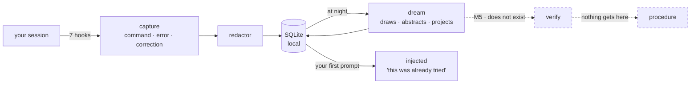

# nightshift

**A procedural memory layer over the agent's native declarative memory.**
A proof of concept, not a product.

*[Léeme en español](README.es.md)*


> **Status: M3 built** — capture, retrieval and dream phase 1, as a Claude Code plugin.
> Everything below runs. The gate is `make dogfood`.
>
> **Nobody has measured that any of this helps.** That was the benchmark's question and
> it is paused, not answered. `verify` does not exist, nothing reaches `procedure`, and
> every memory injected today is unverified.

## What it does, in plain words

An agent's native memory is **declarative**: it learns *facts*. "The timeout is 2000ms."
That already works, and nightshift does not touch it.

nightshift adds the other half, the **procedural** one: remembering **how** a problem got
solved.

1. **It watches your trajectory.** Your commands, your errors, your corrections —
   redacted, on your machine, in SQLite. Nothing goes over the network.

2. **At night it dreams about it.** It turns that trajectory into the problem's
   **mechanism**, drawn as a physical scene rather than as technical prose. This one came
   out of this repo's own store; it is not a made-up example:

   > **`tamiz sin agujero`** (*sieve with no hole*) — *Sealed drums travel down a belt to
   > an arch with a cut-out template: the one that fits through the gap lights the green
   > lamp and goes on to the truck. The template measures height and width, nothing else.*

   It was a check that came up green because it counted items without looking inside them.

3. **It projects forward.** From that mechanism it writes **symptoms nobody has seen
   yet**: which other faces the same problem will come back wearing.

4. **It hands it back before, not after.** Next session, if you describe a symptom that
   hooks one of those, what was done last time reaches you **before** you repeat the same
   mistakes.

The difference in one line: not *"the timeout is 2000"*, but *"this was already tried,
someone raised the limit, it got corrected because it papered over the symptom, and that
discarded path was still right when the limit was genuinely too low."*

In one sentence: **so the next session does not walk from scratch the road the last one
already walked.**



## The three ideas we are after

These are the objectives. Everything in the repo exists to serve one of them, and each one
has hypotheses that say whether it holds — `make experiments` runs them.

**1 · CTE — the chain of thought *is* the chain of execution.** For a coding agent these
are not two things. The reasoning that survives is not an internal monologue, it is the
sequence that touched the filesystem: hypothesis → command → error → correction → decisive
signal → fix. That chain is what gets captured, redacted, as a trajectory.

**2 · Run the chain forward, not backward.** A chain of thought normally explains
something that already happened. Dream walks it the other way — trajectory → mechanism →
abstraction → **conjecture** — so memory can latch onto a problem *before* its symptom has
appeared once. Conjectures are stored apart, weighed at exactly half, and always announced
as conjecture ([ADR-004](doc/adr/ADR-004-ideacion-y-proyeccion.md)). If that boundary
blurs, this stops being memory. And a conjecture nobody resolves is a note, not memory:
`/nightshift:resolve` records that one happened, or that it cannot — always with evidence
and an author.

**3 · Imagine instead of think.** Before abstracting, draw. The consolidation prompt opens
by refusing to reason: *"don't reason yet — find the image."* Some explanations only land
when someone draws them well, and the right drawing does not add information, it removes
what is redundant. The bet is falsifiable — *a drawing of a mechanism is invariant across
symptoms in a way prose is not* — and it is the one still being argued: as of 2026-08-29,
against a 5-symptom held-out set, the `mermaid` arm hooks 4 and the physical scene hooks
**0**, precisely because the scene does not name the domain. The scene stays the default by
Matías's decision ([ADR-007](doc/adr/ADR-007-la-escena-antes-del-diagrama.md)), not by
verdict.

## What it is not

Claude Code ships **Auto Memory** (per-repo declarative notes) and **Auto Dream**
(background consolidation). nightshift does **not** replace them and does not compete on
"notes + sleep": it runs on top ([ADR-001](doc/adr/ADR-001-no-competir-con-auto-dream.md)).

> Auto Memory remembers *what is true in this repo*. nightshift remembers *how it was
> found out*.

| | Capability | Built? |
|---|---|---|
| A | Procedural memory: the trajectory, not just the conclusion | yes |
| B | Discarded alternatives kept **with the precondition** that made them right | yes ([ADR-005](doc/adr/ADR-005-contraste-entre-implementaciones.md)) |
| C | Transfer across repositories | off by default |
| D | Every injection traceable to its source (`why`) | yes |
| E | Verification: nothing becomes a procedure until reproducing it passes a gate | **no — this is M5** |

E is the one that matters, and it is the one that does not exist.

## Run it

```sh
git clone https://github.com/EvolvingAgentsLabs/nightshift
cd nightshift
./bin/nightshift init          # creates the store, resolves deny_paths
claude --plugin-dir .          # load it in this session

make dogfood                   # the gate: check + doctor + audit + status, on the REAL store
make experiments               # which of the project's hypotheses are actually verified
```

| Skill | What it answers |
|---|---|
| `/nightshift:status` | what is stored, what got injected here |
| `/nightshift:why <id>` | where an injection came from, step by step |
| `/nightshift:resolve` | did a projected symptom happen? record it, with evidence |
| `/nightshift:dream` | consolidate now instead of waiting for the night |
| `/nightshift:sleep` | seal the current chapter and dream on it, mid-session |
| `/nightshift:schedule` | install the nightly run |
| `/nightshift:doctor` | is capture actually working |
| `/nightshift:dev` | start a development session on the plugin itself |

## The honest part

The benchmark that would answer *"does remembering how something was figured out improve
an agent that already has declarative memory?"* has its runner, its three fixture repos
and its agent adapter — and **has never run**. It is **paused**, and paused is not closed:
the 25 `TODO(Matias)` in the pre-registration are untouched and the question stays open.

Everything injected today is a `candidate`: abstracted by a model, reproduced by nobody.
**And one of them is false.** On 2026-08-28 dream consolidated a one-line bug and produced
a mechanism that does not exist — with a diagram, an analogy and five coherent
preconditions. It did not hallucinate it: it lifted the reasoning already written in the
code's own comments and presented it as its diagnosis. That is why nothing reaches
`procedure`.

A rehearsal is not evidence, a demonstration is not a result, and neither is a projection
that came true twice.

The long form — the nights it dreamed about itself, the defect that only showed up when
someone measured the promise, and what each fix was actually worth — is in
[`doc/LOGBOOK.md`](doc/LOGBOOK.md).

## Where to look next

- [`doc/00-spec.md`](doc/00-spec.md) — the spec
- [`doc/PLAN-TRES-IDEAS.md`](doc/PLAN-TRES-IDEAS.md) — what each of the three ideas is still missing
- [`doc/LOGBOOK.md`](doc/LOGBOOK.md) — what actually happened, at its real size
- [`experimentos/hipotesis/`](experimentos/hipotesis/) — one hypothesis per file: **24 hypotheses**. `make experiments` walks them and says which hold
- [`doc/adr/`](doc/adr/) — the decisions and what each one cost
- [`experimentos/`](experimentos/) — runnable experiments, including the ones whose results do not favour the plugin
- [`LATER.md`](LATER.md) — everything found and not fixed

## License

Apache 2.0. See [`LICENSE`](LICENSE).
