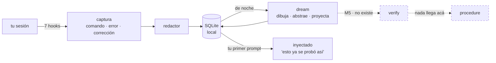

# Cómo funciona nightshift

Esto es lo que era [`README.es.md`](../README.es.md). Se movió acá el 2026-08-29 para
que el README arranque por **dónde encaja esta arquitectura**; la máquina en sí está
descrita acá, sin cambios.

*[In English](HOW-IT-WORKS.md)*

**Una capa de memoria procedimental sobre la memoria declarativa nativa del agente.**
Una prueba de concepto, no un producto.

*[Read me in English](../README.md)*


> **Estado: M3 construido** — captura, retrieval y dream fase 1, como plugin de Claude
> Code. Todo lo de abajo corre. El gate es `make dogfood`.
>
> **Nadie midió que nada de esto ayude.** Ésa era la pregunta del benchmark y está
> pausada, no respondida. `verify` no existe, nada llega a `procedure`, y toda memoria
> que se inyecta hoy está sin verificar.

## Qué hace, en simple

La memoria nativa de un agente es **declarativa**: aprende *hechos*. "El timeout es
2000ms". Eso ya funciona y nightshift no lo toca.

nightshift agrega la otra mitad, la **procedimental**: recordar **cómo** se resolvió un
problema.

1. **Mira tu trayectoria.** Tus comandos, tus errores, tus correcciones — redactados, en
   tu máquina, en SQLite. Nada sale por red.

2. **De noche sueña con ella.** Convierte esa trayectoria en el **mecanismo** del
   problema, dibujado como una escena física en vez de como prosa técnica. Éste salió del
   store de este repo, no es un ejemplo inventado:

   > **`tamiz sin agujero`** — *Por una cinta viajan bidones cerrados hasta un arco con
   > una plantilla recortada: el que entra por el hueco enciende la lámpara verde y sigue
   > al camión. La plantilla mide alto y ancho, nada más.*

   Era un chequeo que daba verde porque contaba elementos sin mirar lo que tenían adentro.

3. **Proyecta hacia adelante.** Desde ese mecanismo escribe **síntomas que nadie vio
   todavía**: con qué otras caras va a volver el mismo problema.

4. **Te lo devuelve antes, no después.** En la sesión siguiente, si describís un síntoma
   que engancha con alguno de ésos, lo que se hizo la vez anterior te llega **antes** de
   que repitas los mismos errores.

La diferencia, en una línea: no *"el timeout es 2000"*, sino *"esto ya se probó, alguien
subió el límite, se corrigió porque tapaba el síntoma, y ese camino descartado igual tenía
razón cuando el límite era genuinamente bajo"*.

En una frase: **que la próxima sesión no recorra de cero el camino que la anterior ya
recorrió.**



## Las tres ideas que perseguimos

Éstos son los objetivos. Todo lo que hay en el repo existe para servir a alguno, y cada
uno tiene hipótesis que dicen si se sostiene — `make experiments` las corre.

**1 · CTE — la cadena de pensamiento *es* la cadena de ejecución.** Para un agente de
código no son dos cosas. El razonamiento que sobrevive no es un monólogo interno: es la
secuencia que tocó el filesystem — hipótesis → comando → error → corrección → señal
decisiva → fix. Esa cadena es lo que se captura, redactada, como trayectoria.

**2 · Correr la cadena para adelante, no para atrás.** Una cadena de pensamiento
normalmente explica algo que ya pasó. Dream la recorre al revés — trayectoria → mecanismo
→ abstracción → **conjetura** — para que la memoria pueda enganchar con un problema
*antes* de que su síntoma se haya visto una vez. Las conjeturas se guardan aparte, pesan
exactamente la mitad y se anuncian siempre como conjetura
([ADR-004](adr/ADR-004-ideacion-y-proyeccion.md)). Si ese límite se borra, esto deja de
ser memoria. Y una conjetura que nadie resuelve es una nota, no memoria:
`/nightshift:resolve` registra que pasó, o que no puede — siempre con evidencia y autor.

**3 · Idear en vez de razonar.** Antes de abstraer, dibujar. El prompt de consolidación
arranca negándose a razonar: *"no razones todavía — encontrá la imagen."* Algunas
explicaciones sólo entran cuando alguien las dibuja bien, y el dibujo correcto no agrega
información: saca la que sobra. La apuesta es falsable —*el dibujo de un mecanismo es
invariante entre síntomas de un modo que la prosa no lo es*— y es la que sigue en
discusión: al 2026-08-29, contra un retenido de 5 síntomas, el brazo `mermaid` engancha 4
y la escena física engancha **0**, justamente porque la escena no nombra el dominio. La
escena sigue siendo el default por decisión de Matías
([ADR-007](adr/ADR-007-la-escena-antes-del-diagrama.md)), no por veredicto.

## Qué no es

Claude Code trae **Auto Memory** (notas declarativas por repo) y **Auto Dream**
(consolidación en segundo plano). nightshift **no** los reemplaza y no compite en "notas +
sueño": corre encima ([ADR-001](adr/ADR-001-no-competir-con-auto-dream.md)).

> Auto Memory recuerda *qué es cierto en este repo*. nightshift recuerda *cómo se
> averiguó*.

| | Capacidad | ¿Construida? |
|---|---|---|
| A | Memoria procedimental: la trayectoria, no sólo la conclusión | sí |
| B | Alternativas descartadas guardadas **con la precondición** que las hacía correctas | sí ([ADR-005](adr/ADR-005-contraste-entre-implementaciones.md)) |
| C | Transferencia entre repositorios | apagada por defecto |
| D | Cada inyección trazable hasta su origen (`why`) | sí |
| E | Verificación: nada es procedimiento hasta que reproducirlo pasa un gate | **no — eso es M5** |

E es la que importa, y es la que no existe.

## Correlo

```sh
git clone https://github.com/EvolvingAgentsLabs/nightshift
cd nightshift
./bin/nightshift init          # crea el store, resuelve deny_paths
claude --plugin-dir .          # cargalo en esta sesión

make dogfood                   # el gate: check + doctor + audit + status, sobre el store REAL
make experiments               # cuáles hipótesis del proyecto están comprobadas
```

| Skill | Qué contesta |
|---|---|
| `/nightshift:status` | qué hay guardado, qué se inyectó acá |
| `/nightshift:why <id>` | de dónde salió una inyección, paso por paso |
| `/nightshift:resolve` | ¿pasó un síntoma proyectado? registralo, con evidencia |
| `/nightshift:dream` | consolidar ahora en vez de esperar a la noche |
| `/nightshift:sleep` | sellar el capítulo en curso y soñar con él, a mitad de sesión |
| `/nightshift:schedule` | instalar la corrida nocturna |
| `/nightshift:doctor` | ¿la captura está funcionando de verdad? |
| `/nightshift:dev` | empezar una sesión de desarrollo sobre el plugin mismo |

## La parte honesta

El benchmark que contestaría *"¿recordar cómo se resolvió algo mejora a un agente que ya
tiene memoria declarativa?"* tiene su runner, sus tres repos de fixture y su adapter de
agente — y **nunca corrió**. Está **pausado**, y pausado no es cerrado: los 25
`TODO(Matias)` del pre-registro siguen sin tocar y la pregunta sigue abierta.

Todo lo que se inyecta hoy es `candidate`: lo abstrajo un modelo, no lo reprodujo nadie.
**Y una de ellas es falsa.** El 2026-08-28 dream consolidó un bug de una línea y produjo un
mecanismo que no existe — con diagrama, analogía y cinco precondiciones coherentes. No lo
alucinó: levantó el razonamiento ya escrito en los comentarios del propio código y lo
presentó como su diagnóstico. Por eso nada llega a `procedure`.

Un ensayo no es evidencia, una demostración no es un resultado, y una proyección que se
cumplió dos veces tampoco.

La versión larga —las noches en que soñó sobre sí mismo, el defecto que apareció cuando
alguien midió la promesa, y cuánto valía cada arreglo— está en
[`doc/BITACORA.md`](BITACORA.md).

## Dónde mirar después

- [`doc/00-spec.md`](00-spec.md) — la spec
- [`doc/PLAN-TRES-IDEAS.md`](PLAN-TRES-IDEAS.md) — qué le falta a cada una de las tres ideas
- [`doc/BITACORA.md`](BITACORA.md) — qué pasó de verdad, en su tamaño real
- [`experimentos/hipotesis/`](../experimentos/hipotesis/) — una hipótesis por archivo: **24 hipótesis**. `make experiments` las recorre y dice cuáles se sostienen
- [`doc/adr/`](adr/) — las decisiones y lo que costó cada una
- [`experimentos/`](../experimentos/) — experimentos que se corren, incluidos los que no favorecen al plugin
- [`LATER.md`](../LATER.md) — todo lo encontrado y no arreglado

## Licencia

Apache 2.0. Ver [`LICENSE`](../LICENSE).
